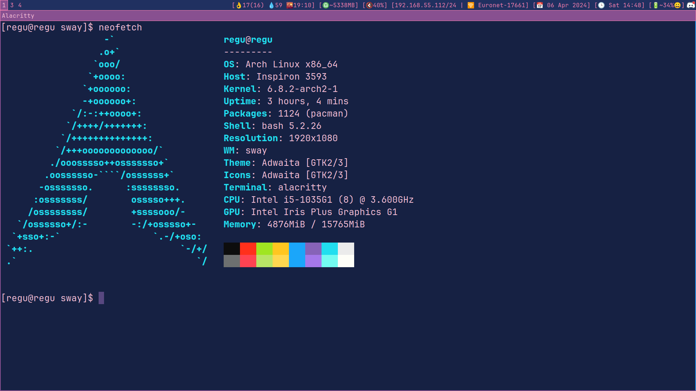

# Sway config

Sway config themed with `starry night` color palette. Repo also contains simple hackable status bar implementation in bash.

## Usage

Just copy files to `~/.config/sway`. It uses following add-ons/dependencies that need to be installed separately:
```
  - gammastep (color temp. manipulation)
  - slurp (screenshot area selection tool)
  - grim (screenshot tool)
  - wmenu (launcher)
  - swaybg (background setting tool)
  - xorg-xwayland
  - amixer (sound output manipulation)
  - brightnessctl (screen brightness manipulation)
  - Alacritty (default terminal)
  - fonts (JetBrain Mono, Noto Color Emoji)
```

## Status bar
Status bar implements following info:
```
  - Battery
  - Time/date
  - Network info (uses nmcli and ip commands)
  - Sound info
  - Memory (just subtracts total from available)
  - Weather info (uses Ninja API and requires Api key)
```
It can be configured to some degree thru `status-config.sh`. To add your own info or tweak existing just follow the pattern presented in `status.sh` and `status-config.sh`.

## Showcase

